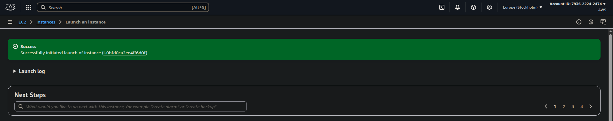

## WEB STACK IMPLEMENTATION (LEMP STACK) ON AWS

### Introduction:

__The LEMP stack is a very well-known web development platform, it is open source and it is made up of four main components which are: Linux, NGINX, MySQL, and PHP (sometimes Perl or Python). This documentation shows how to setup, configure and use the LEMP stack for your consumption.__

## Step 0: Getting Ready

_Here, we ensure that the environment (Linux OS) we need to run/serve our website is made ready. Side note, I use the ubuntu os on my PC_

__1.__ Spin up an EC2 instance of t3.micro with the Ubuntu 24.04 LTS Operating System (I used eu-north-1)



__2.__ Create an SSH Key pair when launching/creating the instance.

__3.__ While creating this EC2 instance, it is important to create a security group configured with the below inbound rules:

- Allow traffic on port 80 (HTTP) from any source IP on the internet
- Allow traffic on port 443 (HTTPS) from any source IP on the internet
- Allow traffic on port 22 (SSH) from any source IP _(This rule is allowed by default)_
 
 __4.__ Select the right VPC when creating the EC2 instance (in my case, I used the default VPC).

 __5.__ Download private key, and modify private key file permissions, so that only your user can access the ssh key.
 ```
 chmod 600 "your-ec2-key.pem"
 ```  
 If you try to ssh wuthout doing this you would get `Permission denied` error, that looks like this  
 

 __6.__ Use private key to access the EC2 instance from your terminal with the help of running this commmand: 
 
 ```
 ssh -i "your-ec2-key.pem" <username>@IPAddress
 ```
 in my case, __username=ubuntu__ and __public ip address=52.228.16.110 (this address changes at every shutdown and startup of an instance (Elastic IP))__

 


 ## Step 1 - Install NGINX
**1.** __First, you have to update and upgrade the package manager's repository__

To achieve this, after connecting to the instance, run this command on your terminal.
```
sudo apt update
sudo apt upgrade -y
```


__2.__ __Install Nginx__
```
sudo apt install nginx -y
```


__3.__ __Enable NGINX and Verify that it is running__
```
sudo systemctl enable nginx
sudo systemctl status nginx
```
after runnnig the `systemctl status` command, if the output has the green indication saying `active (running)` _(as shown in the image below)_ , then nginx is up and running.

Note: You typically do not need to explicitly enable nginx, after installing it, it starts automatically. We were just playing it extra safe.


__4.__ __Verify that the server is running and can be accessed locally via ubuntu shell by running this command__
```
curl http://localhost:80
OR
curl http://127.0.0.1:80
```

__5.__ __Test if you can access the default page NGINX serves on server by trying to access your EC2 public IP via a browser__
```
http://51.20.126.228
```

This indicates that the web server has been correctly installed and is now accessible through the firewall.

## Step 2 - Install MySQL
__1.__ __Install a Realational Database (RDB) to handle webapp__

MySQL would be installed for this case. This is a widely used relational database managemet system that works well within PHP environments.
```
sudo apt install mysql-server
```
 type y and press Enter, when prompted.

__2.__ __Enable mysql and Ensure that it is running by running these commands:__
```
sudo systemctl enable --now mysql
sudo systemctl status mysql
```

__3.__ __Log in to mysql console__
```
sudo mysql
```
Running this command will conect your shell to the MySQL server as the admin database user __root__ assumed by the useof __'sudo'__ when you were executing the __`sudo mysql`__ command.

__4.__ __Assign a password to the root user using the mysql_native_password as the default authetication method.__
The password assigned to the user for the purpose of this documentation is "password"
```
ALTER USER 'root'@'localhost' IDENTIFIED WITH mysql_native_password BY 'password';
```


Exit the MySQL shell 
```
exit
```

__5.__ __Run the script to secure MySQL__

This script is used to remove some insecure default settings and locks down access to the database system.
```
sudo mysql_secure_installation
```


__6.__ __Login to the MySQL console as a root user after you have changed the password.__
```
sudo mysql -p
```
A prompt asking you to insert a password (this is because of the -p flag) as shown in the image below:


### Step 3 - Install PHP

__1.__ __Install php.__

To set up php on the server, we would need to install:
* php package
* php-mysql _(this is a PHP module that allows PHP to communicate with MySQL databases)_
* libnginx-mod-php _(this helps NGINX to handle and understand PHP files)
to get this all set up in the machine, run:
```
sudo apat install php libnginx-mod-php php-fpm php-mysql
```


Confirm the PHP version by running:
```
php -v
```


To test this setup, we need to setup an NGINX Virtual host to hold the website's files and folders.
_(Virtual Hosts makes it possible to have many/different websites located on one machine while abstracting this from the users.)_

## Step 4 - Configure NGINX for PHP
__1.__ __First, create a document directory for the new website you are about to create near the default web dir _(/var/www/).__
```
cd /var/www/
sudo mkdir lemp_project
```

__Assign the ownership of the directory to the current user in the session__
```
sudo chown -R $USER:$USER /var/www/lemp_project
```


__2.__ __Create a configuration file for the new website__
```
sudo nano /etc/nginx/sites-available/lemp_project
```
Write the configurations shown below into the config file:


__3.__ __Activate the nginx configuration__
```
sudo ln -s /etc/nginx/sites-available/lemp_project /etc/nginx/sites-enabled
```

__4.__ __Test the nginx configuration__
```
sudo nginx -t
```


__5.__ __Disable the default config__

_To disable NGINX's default configuration, run this command_
```
sudo unlink /etc/nginx/sites-enabled/default
```

__6.__ __Reload nginx service__
Reload nginx config, to apply changes to nginx config
```
sudo systemctl reload nginx
```

__7.__ __Create index page__
```
sudo echo 'Hello LEMP from hostname:' ec2-51-20-126-228.eu-north-1.compute.amazonaws.com ' with public IP ' 51.20.126.228 > /var/www/lemp_project/index.html
```


## Step 5 - Test PHP Requests
__1.__ __Create sample php file:__  

```
sudo nano /var/www/lemp_prolect/info.php
```

And then add this code:
```
<?php 
phpinfo();
```

__2.__ __Acccess the info.php file from the browser__

```
http://51.20.126.228/info.php
```
You would get a page that looks like this: 


## Step 6 - Retrieving Data from a MySQL DB with PHP
__1.__ __Log into MySQL:__
```bash
sudo mysql -p
```

__2.__ __Create a Database:__
```sql
CREATE DATABASE todo_database;
```

__3. Create a User and Grant Privileges:__
```sql
CREATE USER 'user1'@'%' IDENTIFIED WITH mysql_native_password BY 'passworD123@';
GRANT ALL ON todo_database.* TO 'user1'@'%';
```

__4.__ __Exit MySQL Console:__
```sql
exit
```

__5. Login as New User:__
```bash
mysql -u user1 -p
```

__6. Create a Table:__
```sql
USE todo_database;
CREATE TABLE todo_list (
    item_id INT AUTO_INCREMENT,
    content VARCHAR(255),
    PRIMARY KEY (item_id)
);
```

__7. Insert Records:__
```sql
INSERT INTO todo_database.todo_list (content) VALUES ("This is the first most important task I have to do for the day");

INSERT INTO todo_database.todo_list (content) VALUES ("This is the second task I have to do for the day - in order of hierarchy");

INSERT INTO todo_database.todo_list (content) VALUES ("This is the third task I have to do for the day - in order of hierarchy");

INSERT INTO todo_database.todo_list (content) VALUES ("Let me quickly add this one more item to my to do list before I forget");
```

__8. Verify Data:__
```sql
SELECT * FROM todo_list;
```


Exit MySQL:
```sql
EXIT;
```

__9. Create a PHP Script to Retrieve Data:__
```bash
sudo nano /var/www/lemp_project/todo_list.php
```

Add this code:
```php
<?php
$user = "user1";
$password = "passworD123@";
$database = "todo_database";
$table= "todo_list";

try {
    $db = new PDO("mysql:host=localhost;dbname=$database", $user, $password);
    echo "<h2>TODO List</h2><ol>";
    foreach ($db->query("SELECT content FROM $table") as $row) {
        echo "<li>" . $row['content'] . "</li>";
    }
    echo "</ol>";
} catch (PDOException $e) {
    echo "Connection failed: " . $e->getMessage();
}
?>
```

__10. Access ToDo list__
```
http://35.178.88.186/todo_list.php
```


## Conclusion
Congratulations! You've successfully set up a LEMP stack on AWS. This LEMP stack (just like the LAMP stack) provides a solid platform for hosting and serving web apps. If you as a developer want to deploy scalable solutions that can be relied upon, then you would need to seriously consider one of these stacks as they have been tested, tried and proven to meet expectations.